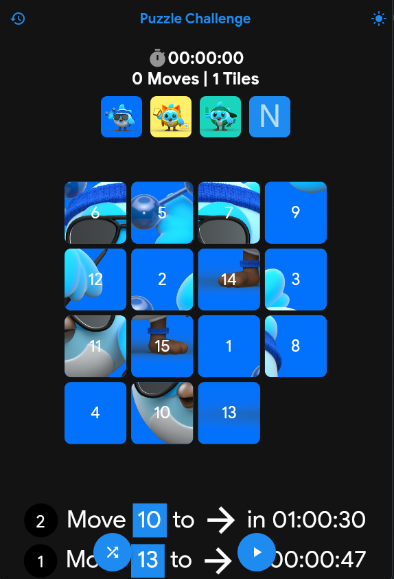
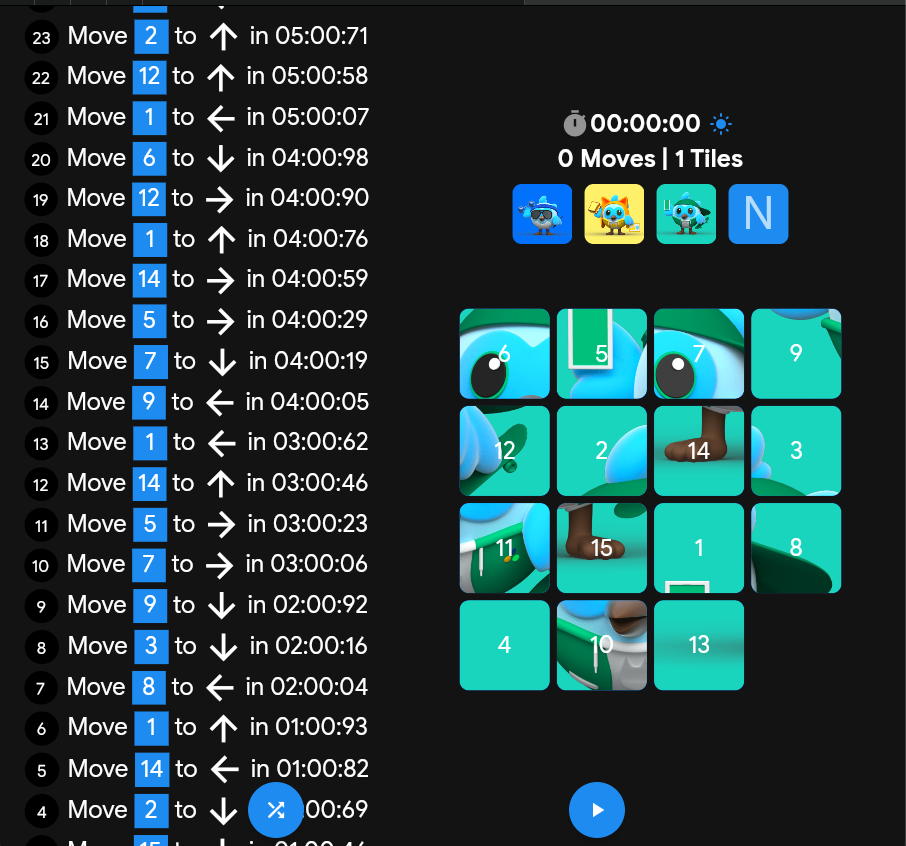
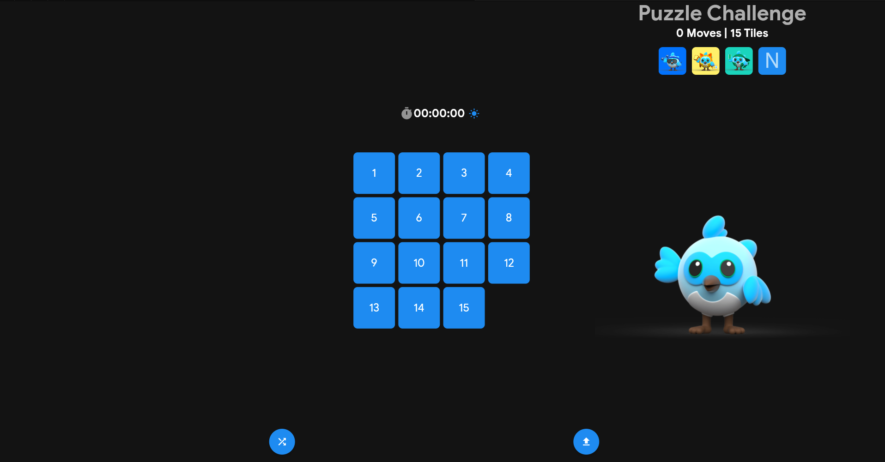

# puzzle_hack

My game on [Puzzle hack](https://flutter.dev/events/puzzle-hack)

## Getting Started

### Small screen
</img>
### meduim screen
</img>
### Large screen
</img>

## Main feature

Sharing the Win Key:

1. After completing a puzzle and successfully recreating the image, you will be rewarded with a unique win key.
2. The win key serves as proof of your victory and can be shared with your friends.
3. By sharing the win key with your friends, they can enter it into the game to replay the puzzle you completed.
4. This feature allows you and your friends to compete against each other, or simply enjoy solving the same puzzle for fun.

Game provides an engaging and enjoyable experience for puzzle enthusiasts, with the added ability to share win keys with friends, fostering friendly competition and collaboration.